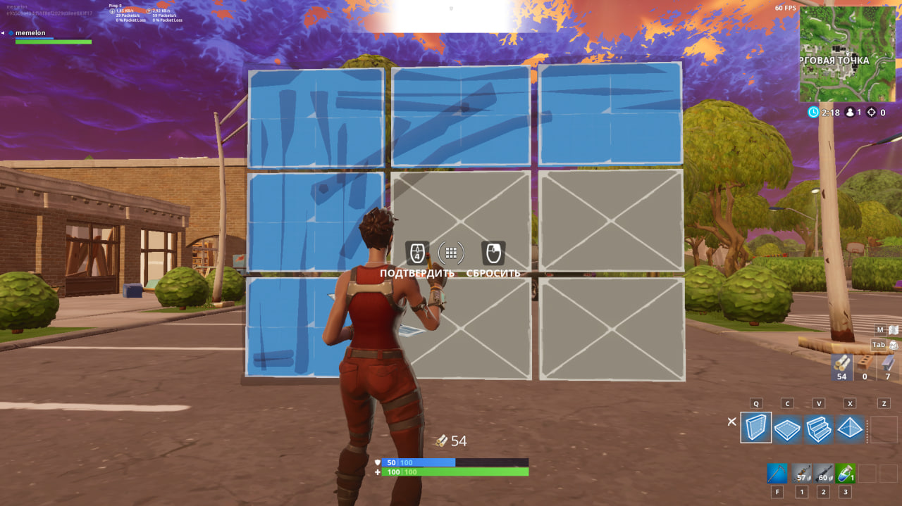

# Fortnite Edit on Release Macro

A lightweight, high-performance C# Windows Forms application that simulates the **"Edit on Release"** functionality for Fortnite.

It automatically confirms your building edits as soon as you release the Left Mouse Button (LMB), replicating the native edit-on-release behavior. It works with any key bind (keyboard keys or mouse buttons, including side buttons).

---

## 🚀 Features

* **Low Latency**: Built using low-level global Windows hooks (`SetWindowsHookEx`) and `SendInput` API for direct input injection.
* **Universal Bindings**: Works with keyboard keys and mouse buttons (Right Click, Middle Click, Side Buttons XButton1/XButton2).
* **Game Engine Compatibility**: Simulates hardware **Scan Codes** (via `MapVirtualKey`) and implements a micro-delay (15ms) between key-down and key-up events, which is necessary for Unreal Engine to process the input correctly.
* **Instant Toggle**: Use the global hotkey **`F10`** to enable or disable the macro instantly while in-game without alt-tabbing.
* **Sleek Dark GUI**: Minimalist dark-themed user interface with a real-time status indicator.
* **Zero Dependencies**: Compiled as a self-contained single-file executable (`.exe`). Runs out of the box without requiring .NET installation.

---

## 📸 Preview



---

## 🛠️ Installation & Usage

1. Download the compiled executable or build it from source.
2. **Important:** Right-click `Edit_on_release.exe` and select **"Run as Administrator"**. (This is required because Fortnite runs with elevated privileges due to anti-cheat, and Windows blocks inputs sent from standard applications).
3. In the program UI, click the **"Edit Key: ..."** button. It will change to `Press any Key or Mouse Button...`.
4. Press the key or mouse button that you use to start editing in Fortnite (e.g., `F`, `G`, or a Side Mouse Button).
5. Minimize the application.
6. In game: press your edit key, click and drag LMB to select tiles, and release LMB. The macro will automatically trigger the edit key to confirm the edit.

> 💡 **Tip:** Press **`F10`** globally to toggle the macro on/off. The indicator light will change to green (Active) or red (Inactive).

---

## 📦 Building from Source

To compile the application yourself, make sure you have the [.NET 10 SDK](https://dotnet.microsoft.com/download) installed:

1. Clone the repository:
   ```bash
   git clone https://github.com/verysteelsmaker/Edit-On-Release-Fortnite
   cd Edit-On-Release-Fortnite
   ```
2. Publish as a self-contained single-file executable for Windows x64:
   ```bash
   dotnet publish -c Release -r win-x64 -p:PublishSingleFile=true -p:SelfContained=true -p:PublishReadyToRun=true --output ./build
   ```
3. Find the compiled `Edit_on_release.exe` inside the `./build` directory.

---

## ⚠️ Disclaimer

This software is an external input simulation macro. Use it at your own risk. The developer is not responsible for any bans or actions taken by Easy Anti-Cheat, BattlEye, or Epic Games. While this tool does not inject into or read game memory, macro usage may violate Fortnite's Terms of Service.
